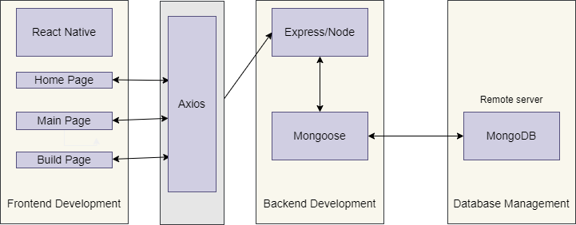

# Orbital-TSS

README (caa 28 May 2023)

### Project Aim:

The aim of our orbital project is to develop a comprehensive mobile application for Lego enthusiasts, offering a range of features including model recognition, build planning, personal Lego set database, and access to official Lego building instructions. The goal is to provide a one-stop tool that facilitates and enhances the Lego building experience for users.

### Project Description:

The first feature is the model recognition capability. Users can capture lego pieces through their phone camera. With the object detection model, the app can identify the Lego pieces, providing information such as piece names, quantities, and colors.

The second feature is the build planner. Users can select an existing Lego set tied to their account from the database. The app then provides step-by-step instructions sourced from official Lego building instructions or community-generated techniques. Users can then follow the guided instructions when building their lego sets. This feature assists users in planning and executing their builds efficiently.

The app also includes a personal Lego set database, allowing users to create and manage their Lego collections. Users can manually add sets they own, along with details such as set number, name, theme, and release year. This feature provides a convenient overview of their Lego collection, enabling effective management and organization.

### Structure

Our folders are organised as per the following:

    .
    ├── src
        ├── client                   # Source folders for React Native app
            ├── App.tsx              # Main folder
            ├── Assets
            ├── data
            ├── Frontend
            └── Backend
        └── server                   # Local server to communicate with MongoDB
            ├── routes
            ├── models
            └── controllers
    └── index.js

### High-Level Overview

### User stories

Our product should enable the user of the mobile application to:
1. Create a personalized profile within the mobile application, so that users can keep track of their Lego data and have a personalized experience.
2. Add Lego sets to their collection within the mobile application, including details such as set number, name, theme, and year of release, to easily keep track of Lego sets.
3. Access a visual development guide or step-by-step instructions for building a Lego model within the mobile application.
4. Search for specific Lego pieces with the camera app, to locate the exact piece required for the build without hassle.

### Description of Key Features

1. Login system (implemented)\
On the Home Screen, the user first clicks on the “Signup” button which navigates the user to the SignupPage. There, the user enters his username and password. When “Create Account” is pressed, a POST request containing the user’s details is sent over and stored inside the MongoDB database. This entry then belongs to the user. When the user adds in lego sets to his collection, this information is stored in the same entry in the database and can be accessed by the user whenever he logs back in.

2. Searching function (implemented)\
Each lego set comes with a unique ID. In the NewBuildPage, the user searches for lego sets by their lego set ID. The system sends a GET request to the Rebrickable lego sets API which fetches back the array containing the details of the lego set. This information is rendered on the screen in the form of a Touchable component. The user selects this component, and creates this build, adding the lego set into the database. The build will now appear in the existing build page. Upon rendering of the page, it makes a POST request to obtain the array of sets tied to the user, and renders it on the screen.

3. Build Planner (yet to be implemented)\
(To be documented in Milestone 2)

4. Real-time Object Detection (implemented, but yet to be integrated in)\
Our computer vision model trained on a lego dataset is able to identify different lego pieces with relatively high confidence. When the user hovers his camera over a mess of legos, the detection model draws bounding boxes around the lego pieces identified, with a label stating the type of lego piece detected.
Future work: The Builld Planner provides information about the lego pieces required for the next step of the building process. This information is passed into the lego detection model, causing the model to only look for the pieces mentioned.

### Tech stack:

- MongoDB, Express, React-native, Node (MERN)
- Python, OpenCV, PyTorch

### Challenges faced

1. Steep Learning Curve\
Starting off the project with so many frameworks in mind was daunting at times. We took a while to familiarise with the frameworks and began building our project in baby steps, making sure to stay organised along the way.

2. Package Version Control\
It was difficult to track the versions of the packages that both of us had. Some packages were only compatible with specific versions of other packages. Moreover, collaboration became a greater issue when some packages worked for one of us but not the other.

3. Lego Dataset Curation\
Lego pieces come in several shapes, sizes and colour. Creating a good lego dataset that is fully representative of all lego types is tough to accomplish given the short duration of time. We had to weigh our options and focused on an idea which minimised labour costs.

### To run the project

In the server directory,

- Create an .env file to define the port and DB connection.
- npm i
- npm start
  This starts a local server to run HTTP requests and connect to the DB.

In the main root directory,

- Create an .env file to define the port and admin details.
- npm i
- npx react-native start
- npx react-native run-android
